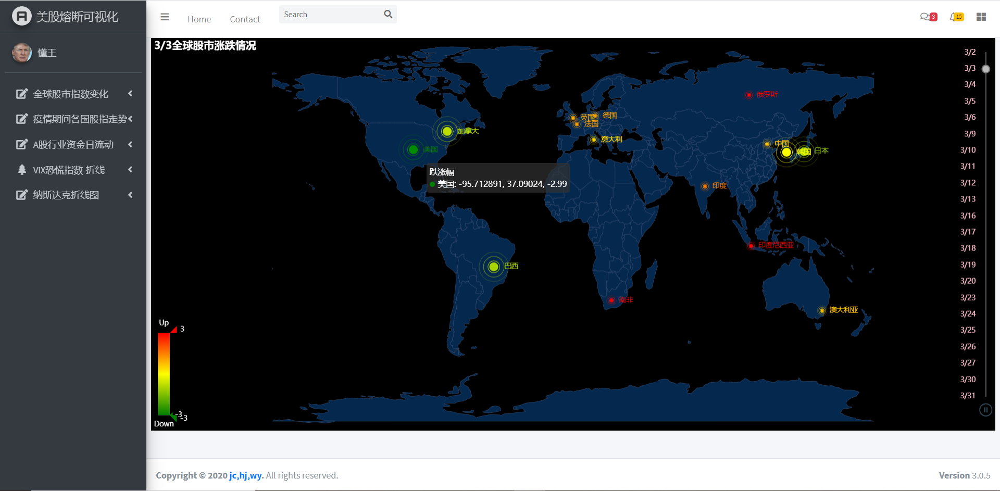
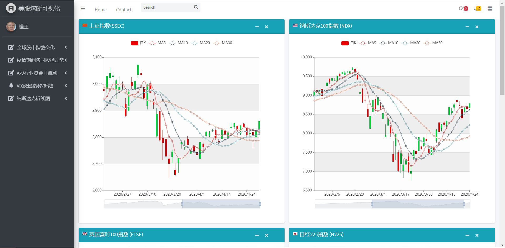
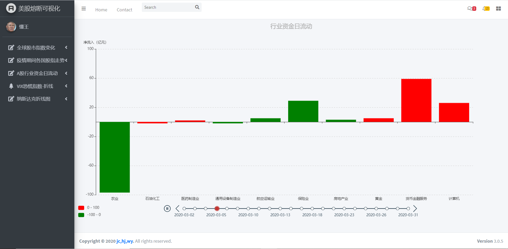
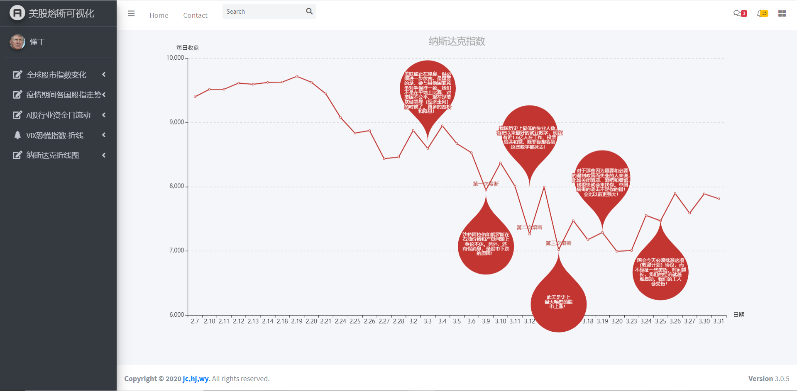

# Stock-Market-Visualization
美股熔断可视化

-   对整个三月全球股市的涨跌变化情况进行可视化，以worldmap-timeline进行显示。

- 选取全球具有代表性的几大股指进行可视化

- 选取A股具有代表性的几个行业进行资金流动的可视化(动态柱状图)

- 美国消费者恐慌指数VIX和全球黄金指数的关联走势可视化，美国失业率可视化

- 美国纳斯达克指数的走势以及懂王推特的打脸言论

